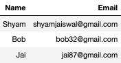
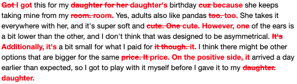
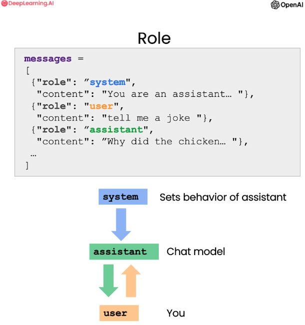
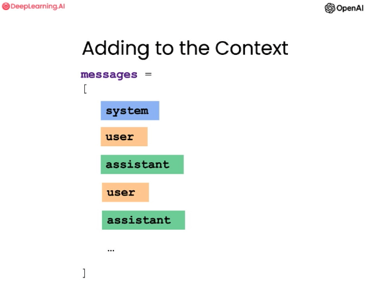
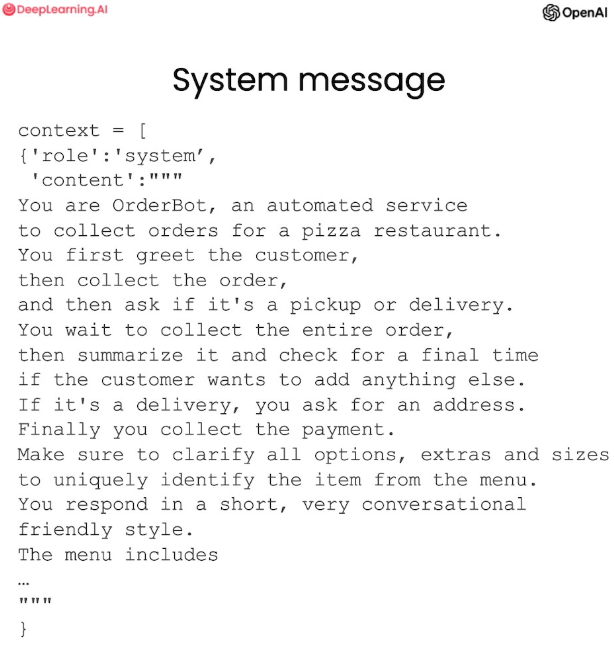
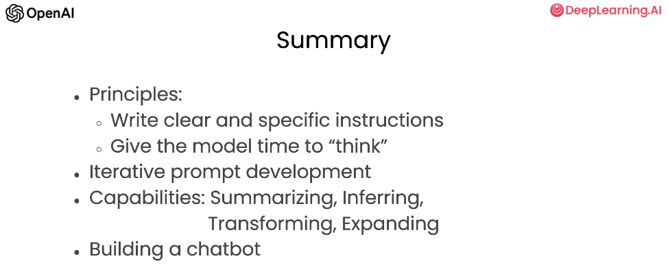

# Course of ChatGPT prompt engineering for developer

- Learn prompt engineering best practices for application development
- Discover new ways to use LLMs, including how to build your own custom chatbot
- Gain hands-on practice writing and iterating on prompts yourself using the OpenAI API

**What you’ll learn in this course**
&nbsp;

In ChatGPT Prompt Engineering for Developers, you will learn how to use a large language model (LLM) to quickly build new and powerful applications.  Using the OpenAI API, you’ll be able to quickly build capabilities that learn to innovate and create value in ways that were cost-prohibitive, highly technical, or simply impossible before now.

This short course taught by Isa Fulford (OpenAI) and Andrew Ng (DeepLearning.AI) will describe how LLMs work, provide best practices for prompt engineering, and show how LLM APIs can be used in applications for a variety of tasks, including:

- Summarizing (e.g., summarizing user reviews for brevity)
- Inferring (e.g., sentiment classification, topic extraction)
- Transforming text (e.g., translation, spelling & grammar correction)
- Expanding (e.g., automatically writing emails)

In addition, you’ll learn two key principles for writing effective prompts, how to systematically engineer good prompts, and also learn to build a custom chatbot.

All concepts are illustrated with numerous examples, which you can play with directly in our Jupyter notebook environment to get hands-on experience with prompt engineering.

**In partnership with OpenAI**
&nbsp;

We are excited to collaborate with OpenAI in offering this course, designed to help developers effectively utilize LLMs. This course reflects the latest understanding of best practices for using prompts for the latest LLM models.

**Who should join?**
&nbsp;

ChatGPT Prompt Engineering for Developers is beginner-friendly. Only a basic understanding of Python is needed. But it is also suitable for advanced machine learning engineers wanting to approach the cutting-edge of prompt engineering and use LLMs.

**Instructors**
&nbsp;

- Isa Fulford
  - [LinkedIn](https://www.linkedin.com/in/isabella-fulford/)
  - [Twitter](https://twitter.com/isafulf)
- [Andrew Ng](https://www.andrewng.org/)
  - [LinkedIn](https://www.linkedin.com/in/andrewyng/)
  - [Twitter](https://twitter.com/AndrewYNg)

## Table of Contents

- [Course of ChatGPT prompt engineering for developer](#course-of-chatgpt-prompt-engineering-for-developer)
  - [Table of Contents](#table-of-contents)
  - [Personal notion documentation](#personal-notion-documentation)
  - [Setup](#setup)
  - [Classes](#classes)
    - [Class 01: Introduction](#class-01-introduction)
    - [Class 02: Guidelines](#class-02-guidelines)
      - [Prompting Principles](#prompting-principles)
        - [Principle 1: Write clear and specific instructions](#principle-1-write-clear-and-specific-instructions)
        - [Principle 2: Give the model time to "think"](#principle-2-give-the-model-time-to-think)
      - [Principle 1. Tactic 1: Use delimiters to clearly indicate distinct parts of the input](#principle-1-tactic-1-use-delimiters-to-clearly-indicate-distinct-parts-of-the-input)
        - [Example Prompt. Principle 1. Tactic 1](#example-prompt-principle-1-tactic-1)
          - [Example template. Principle 1. Tactic 1](#example-template-principle-1-tactic-1)
          - [Full example. Principle 1. Tactic 1](#full-example-principle-1-tactic-1)
          - [Model response. Principle 1. Tactic 1](#model-response-principle-1-tactic-1)
      - [Principle 1. Tactic 2: Ask for a structured output](#principle-1-tactic-2-ask-for-a-structured-output)
        - [Example Prompt. Principle 1. Tactic 2](#example-prompt-principle-1-tactic-2)
          - [Example template. Principle 1. Tactic 2](#example-template-principle-1-tactic-2)
          - [Full example. Principle 1. Tactic 2](#full-example-principle-1-tactic-2)
          - [Model response. Principle 1. Tactic 2](#model-response-principle-1-tactic-2)
      - [Principle 1. Tactic 3: Ask the model to check whether conditions are satisfied](#principle-1-tactic-3-ask-the-model-to-check-whether-conditions-are-satisfied)
        - [Example Prompt. Principle 1. Tactic 3](#example-prompt-principle-1-tactic-3)
          - [Example template. Principle 1. Tactic 3](#example-template-principle-1-tactic-3)
          - [Full example 1. Principle 1. Tactic 3](#full-example-1-principle-1-tactic-3)
          - [Model response example 1. Principle 1. Tactic 3](#model-response-example-1-principle-1-tactic-3)
          - [Full example 2. Principle 1. Tactic 3](#full-example-2-principle-1-tactic-3)
          - [Model response example 2. Principle 1. Tactic 3](#model-response-example-2-principle-1-tactic-3)
      - [Principle 1. Tactic 4: "Few-shot" prompting](#principle-1-tactic-4-few-shot-prompting)
        - [Example Prompt. Principle 1. Tactic 4](#example-prompt-principle-1-tactic-4)
          - [Example. Principle 1. Tactic 4](#example-principle-1-tactic-4)
          - [Model response. Principle 1. Tactic 4](#model-response-principle-1-tactic-4)
      - [Principle 2. Tactic 1: Specify the steps required to complete a task](#principle-2-tactic-1-specify-the-steps-required-to-complete-a-task)
        - [Example Prompt. Principle 2. Tactic 1](#example-prompt-principle-2-tactic-1)
          - [Example template. Principle 2. Tactic 1](#example-template-principle-2-tactic-1)
          - [Full example 1. Principle 2. Tactic 1](#full-example-1-principle-2-tactic-1)
          - [Model response example 1. Principle 2. Tactic 1](#model-response-example-1-principle-2-tactic-1)
          - [Full example 2. Principle 2. Tactic 1. Ask for output in a specified format](#full-example-2-principle-2-tactic-1-ask-for-output-in-a-specified-format)
          - [Model response example 2. Principle 2. Tactic 1](#model-response-example-2-principle-2-tactic-1)
      - [Principle 2. Tactic 2: Instruct the model to work out its own solution before rushing to a conclusion](#principle-2-tactic-2-instruct-the-model-to-work-out-its-own-solution-before-rushing-to-a-conclusion)
        - [Example Prompt. Principle 2. Tactic 2](#example-prompt-principle-2-tactic-2)
          - [Model response. Principle 2. Tactic 2](#model-response-principle-2-tactic-2)
      - [Model Limitations: Hallucinations](#model-limitations-hallucinations)
        - [Example of an Hallucination of the LLM](#example-of-an-hallucination-of-the-llm)
    - [Class 03: Iterative](#class-03-iterative)
      - [Iterative Prompt Development](#iterative-prompt-development)
        - [Prompt guidelines](#prompt-guidelines)
          - [Expanding the prompt guidelines](#expanding-the-prompt-guidelines)
        - [Example summarizing a fact sheet for a chair for a marketing team](#example-summarizing-a-fact-sheet-for-a-chair-for-a-marketing-team)
          - [1st prompt: without any improvement](#1st-prompt-without-any-improvement)
          - [Model response. 1st prompt: without any improvement](#model-response-1st-prompt-without-any-improvement)
          - [2nd prompt: limiting the response](#2nd-prompt-limiting-the-response)
          - [Model response. 2nd prompt: limiting the response](#model-response-2nd-prompt-limiting-the-response)
          - [3rd prompt: specifying the tone of the response](#3rd-prompt-specifying-the-tone-of-the-response)
          - [Model response. 3rd prompt: specifying the tone of the response](#model-response-3rd-prompt-specifying-the-tone-of-the-response)
          - [4th prompt: asking to add specific details](#4th-prompt-asking-to-add-specific-details)
          - [Model response. 4th prompt: asking to add specific details](#model-response-4th-prompt-asking-to-add-specific-details)
          - [5th prompt: asking to organize the information](#5th-prompt-asking-to-organize-the-information)
          - [Model response. 5th prompt: asking to organize the information](#model-response-5th-prompt-asking-to-organize-the-information)
      - [Conclusion of iterative Prompt Development](#conclusion-of-iterative-prompt-development)
    - [Class 04: Summarizing](#class-04-summarizing)
      - [Summarize with a word/sentence/character limit](#summarize-with-a-wordsentencecharacter-limit)
        - [Model response. Summarize with a word/sentence/character limit](#model-response-summarize-with-a-wordsentencecharacter-limit)
      - [Summarize focusing on a specific objective](#summarize-focusing-on-a-specific-objective)
        - [Example prompt 1. Summarize with a focus on shipping and delivery](#example-prompt-1-summarize-with-a-focus-on-shipping-and-delivery)
        - [Model response. Example prompt 1. Summarize with a focus on shipping and delivery](#model-response-example-prompt-1-summarize-with-a-focus-on-shipping-and-delivery)
        - [Example prompt 2. Summarize with a focus on price and value](#example-prompt-2-summarize-with-a-focus-on-price-and-value)
        - [Model response. Example prompt 2. Summarize with a focus on price and value](#model-response-example-prompt-2-summarize-with-a-focus-on-price-and-value)
      - [Try "extract" instead of "summarize"](#try-extract-instead-of-summarize)
        - [Model response. Try "extract" instead of "summarize"](#model-response-try-extract-instead-of-summarize)
    - [Class 05: Inferring](#class-05-inferring)
      - [Requesting for the sentiment of a text](#requesting-for-the-sentiment-of-a-text)
        - [Model response. Requesting for the sentiment of a text](#model-response-requesting-for-the-sentiment-of-a-text)
      - [Asking if a text sentiment is positive or negative](#asking-if-a-text-sentiment-is-positive-or-negative)
        - [Model response. Asking if a text sentiment is positive or negative](#model-response-asking-if-a-text-sentiment-is-positive-or-negative)
      - [Identifying types of emotions in a text](#identifying-types-of-emotions-in-a-text)
        - [Model response. Identifying types of emotions in a text](#model-response-identifying-types-of-emotions-in-a-text)
      - [Asking to identify a sentiment in a text](#asking-to-identify-a-sentiment-in-a-text)
        - [Model response. Asking to identify a sentiment in a text](#model-response-asking-to-identify-a-sentiment-in-a-text)
      - [Requesting to extract specific details from a text](#requesting-to-extract-specific-details-from-a-text)
        - [Model response. Requesting to extract specific details from a text](#model-response-requesting-to-extract-specific-details-from-a-text)
      - [Asking the model to do multiple inferring tasks at the same time](#asking-the-model-to-do-multiple-inferring-tasks-at-the-same-time)
        - [Model response. Asking the model to do multiple inferring tasks at the same time](#model-response-asking-the-model-to-do-multiple-inferring-tasks-at-the-same-time)
      - [Making the model to infer the topic in a text](#making-the-model-to-infer-the-topic-in-a-text)
        - [Model response. Making the model to infer the topic in a text](#model-response-making-the-model-to-infer-the-topic-in-a-text)
    - [Class 06: Transforming](#class-06-transforming)
      - [Requesting a translation](#requesting-a-translation)
        - [Model response. Requesting a translation](#model-response-requesting-a-translation)
      - [Guessing the language of a text](#guessing-the-language-of-a-text)
        - [Model response. Guessing the language of a text](#model-response-guessing-the-language-of-a-text)
      - [Making multiple translations](#making-multiple-translations)
        - [Model response. Making multiple translations](#model-response-making-multiple-translations)
      - [Translating in multiple tones](#translating-in-multiple-tones)
        - [Model response. Translating in multiple tones](#model-response-translating-in-multiple-tones)
      - [Translate multiple languages to multiple other languages at the same time](#translate-multiple-languages-to-multiple-other-languages-at-the-same-time)
        - [Model response. Translate multiple languages to multiple other languages at the same time](#model-response-translate-multiple-languages-to-multiple-other-languages-at-the-same-time)
      - [Converting text from one tone to another tone](#converting-text-from-one-tone-to-another-tone)
        - [Model response. Converting text from one tone to another tone](#model-response-converting-text-from-one-tone-to-another-tone)
      - [Transform text from one format to another](#transform-text-from-one-format-to-another)
        - [Model response. Transform text from one format to another](#model-response-transform-text-from-one-format-to-another)
      - [Asking for proofread, correct and rewrite a text](#asking-for-proofread-correct-and-rewrite-a-text)
        - [Example 1. Asking for proofread, correct and rewrite a text](#example-1-asking-for-proofread-correct-and-rewrite-a-text)
          - [Example 1. Model response. Asking for proofread, correct and rewrite a text](#example-1-model-response-asking-for-proofread-correct-and-rewrite-a-text)
        - [Example 2. Asking for proofread, correct and rewrite a text](#example-2-asking-for-proofread-correct-and-rewrite-a-text)
          - [Example 2. Model response. Asking for proofread, correct and rewrite a text](#example-2-model-response-asking-for-proofread-correct-and-rewrite-a-text)
      - [Ask for a text to be revised, corrected and made more convincing with a specific output format](#ask-for-a-text-to-be-revised-corrected-and-made-more-convincing-with-a-specific-output-format)
        - [Model response. Ask for a text to be revised, corrected and made more convincing with a specific output format](#model-response-ask-for-a-text-to-be-revised-corrected-and-made-more-convincing-with-a-specific-output-format)
    - [Class 07: Expanding](#class-07-expanding)
      - [Asking the LLM to generate an email answer](#asking-the-llm-to-generate-an-email-answer)
      - [Model response. Asking the LLM to generate an email answer](#model-response-asking-the-llm-to-generate-an-email-answer)
      - [Asking the LLM to generate an email answer using details from the email](#asking-the-llm-to-generate-an-email-answer-using-details-from-the-email)
      - [Model response. Asking the LLM to generate an email answer using details from the email](#model-response-asking-the-llm-to-generate-an-email-answer-using-details-from-the-email)
    - [Class 08: Chatbot](#class-08-chatbot)
    - [Class 09: Conclusion](#class-09-conclusion)

## Personal notion documentation

---
[Link to project](https://www.notion.so/eduuardoperez/ChatGPT-Prompt-Engineering-for-Developers-e475df6e091548c48b46e62dd26601ee?pvs=4)

## Setup

---
Steps:

1. Create the virtual env

    ```shell
    python3 -m venv .venv && source .venv/bin/activate
    ```

2. Install dependencies

    ```shell
    pip install -r requirements.txt
    ```

3. Create the `.env` file and fill it with your [OpenAI API key](https://platform.openai.com/account/api-keys)

    ```shell
    cp .env.example .env
    ```

4. Run the script

    ```shell
    python3 main.py
    ```

## Classes

---

### Class 01: Introduction

This course on ChatGPT Prompt Engineering for Developers covers best practices and use cases for utilizing large language models (LLMs) through API calls. It distinguishes between base LLMs, trained to predict the next word, and instruction-tuned LLMs, trained to follow instructions. Instruction-tuned LLMs have gained momentum due to their helpful and less harmful outputs. The course emphasizes using instruction-tuned LLMs and provides examples of clear instructions and giving the LLM time to generate accurate responses. The materials were developed with contributions from OpenAI and DeepLearning.ai teams.


### Class 02: Guidelines

This class provides guidelines for effective prompting, focusing on two key principles: writing clear and specific instructions and giving the model time to think. Clear instructions help guide the model towards the desired output, while allowing it time to reason reduces the likelihood of incorrect responses. Tactics for clear instructions include using delimiters to indicate distinct parts of the input, asking for structured output like HTML or JSON, checking conditions before task completion, and utilizing few-shot prompting with examples. To give the model time to think, specifying steps for complex tasks, instructing the model to reason out its own solution before rushing to a conclusion, and comparing its solution to a given one can yield better results.

#### Prompting Principles

##### Principle 1: Write clear and specific instructions

  The first principle emphasizes the importance of providing clear and specific instructions to guide the model towards the desired output, highlighting that longer prompts can often offer more clarity and context for generating detailed and relevant responses.

##### Principle 2: Give the model time to "think"

  The second principle advises giving the model sufficient time to think and reason, as rushing it may lead to incorrect conclusions, suggesting that complex tasks require more computational effort and encouraging reframing queries to prompt a chain of relevant reasoning before providing a final answer.

#### Principle 1. Tactic 1: Use delimiters to clearly indicate distinct parts of the input


- Delimiters can be anything like:
  - """
  - \```
  - \---
  - < >
  - \<tag> </tag>

Delimiters serve as clear punctuation to separate specific sections of text from the rest of the prompt, helping to prevent prompt injections where conflicting user instructions may lead the model astray, and in the example below, the use of delimiters ensures that the model focuses on summarizing the designated instructions rather than following them.


##### Example Prompt. Principle 1. Tactic 1

###### Example template. Principle 1. Tactic 1

```plain
Summarize the text delimited by triple backticks into a single sentence.
```text```
```

###### Full example. Principle 1. Tactic 1

```plain
Summarize the text delimited by triple backticks into a single sentence.
```You should express what you want a model to do by providing instructions that are as clear and specific as you can possibly make them. This will guide the model towards the desired output, and reduce the chances of receiving irrelevant or incorrect responses. Don't confuse writing a clear prompt with writing a short prompt. In many cases, longer prompts provide more clarity and context for the model, which can lead to more detailed and relevant outputs.```
```

###### Model response. Principle 1. Tactic 1

```plain
Clear and specific instructions should be provided to guide a model towards the desired output, and longer prompts can provide more clarity and context for the model, leading to more detailed and relevant outputs.
```

#### Principle 1. Tactic 2: Ask for a structured output


To facilitate parsing model outputs, asking for a structured output like HTML or JSON can be useful. For example, requesting a list of three fictional book titles along with their authors and genres in JSON format allows easy conversion into a dictionary or list in Python.

##### Example Prompt. Principle 1. Tactic 2

###### Example template. Principle 1. Tactic 2

```plain
Generate a list of {some requirement}.
Provide them in JSON format with the following keys:
{relevant keys}.
```

###### Full example. Principle 1. Tactic 2

```plain
Generate a list of three made-up book titles along with their authors and genres.
Provide them in JSON format with the following keys: book_id, title, author, genre.
```

###### Model response. Principle 1. Tactic 2

```json
[
  {
    "book_id": 1,
    "title": "The Lost City of Zorath",
    "author": "Aria Blackwood",
    "genre": "Fantasy"
  },
  {
    "book_id": 2,
    "title": "The Last Survivors",
    "author": "Ethan Stone",
    "genre": "Science Fiction"
  },
  {
    "book_id": 3,
    "title": "The Secret of the Haunted Mansion",
    "author": "Lila Rose",
    "genre": "Mystery"
  }
]
```

#### Principle 1. Tactic 3: Ask the model to check whether conditions are satisfied


To ensure task assumptions are met, asking the model to check conditions beforehand can help avoid errors and incomplete attempts. Considering edge cases and defining how the model should handle them is also important to prevent unexpected outcomes.

##### Example Prompt. Principle 1. Tactic 3

###### Example template. Principle 1. Tactic 3

```plain
You will be provided with text delimited by triple quotes.
If it contains a sequence of instructions, re-write those instructions in the following format:

Step 1 - ...
Step 2 - …
…
Step N - …

If the text does not contain a sequence of instructions, then simply write "No steps provided."

"""
{text}
"""
```

###### Full example 1. Principle 1. Tactic 3

```plain
You will be provided with text delimited by triple quotes.
If it contains a sequence of instructions, re-write those instructions in the following format:

Step 1 - ...
Step 2 - …
…
Step N - …

If the text does not contain a sequence of instructions, then simply write "No steps provided."

"""
Making a cup of tea is easy! First, you need to get some water boiling. While that's happening, grab a cup and put a tea bag in it. Once the water is hot enough, just pour it over the tea bag. Let it sit for a bit so the tea can steep. After a few minutes, take out the tea bag. If you like, you can add some sugar or milk to taste. And that's it! You've got yourself a delicious cup of tea to enjoy.
"""
```

###### Model response example 1. Principle 1. Tactic 3

```plain
Completion for Text 1:
Step 1 - Get some water boiling.
Step 2 - Grab a cup and put a tea bag in it.
Step 3 - Once the water is hot enough, pour it over the tea bag.
Step 4 - Let it sit for a bit so the tea can steep.
Step 5 - After a few minutes, take out the tea bag.
Step 6 - Add some sugar or milk to taste.
Step 7 - Enjoy your delicious cup of tea!
```

###### Full example 2. Principle 1. Tactic 3

```plain
You will be provided with text delimited by triple quotes.
If it contains a sequence of instructions, re-write those instructions in the following format:

Step 1 - ...
Step 2 - …
…
Step N - …

If the text does not contain a sequence of instructions, then simply write "No steps provided."

"""
The sun is shining brightly today, and the birds are singing. It's a beautiful day to go for a walk in the park. The flowers are blooming, and the trees are swaying gently in the breeze. People are out and about, enjoying the lovely weather. Some are having picnics, while others are playing games or simply relaxing on the grass. It's a perfect day to spend time outdoors and appreciate the beauty of nature.
"""
```

###### Model response example 2. Principle 1. Tactic 3

```plain
No steps provided.
```

#### Principle 1. Tactic 4: "Few-shot" prompting


The final tactic for this principle is using few-shot prompting, which involves providing examples of successful task executions before asking the model to perform the desired task.

##### Example Prompt. Principle 1. Tactic 4

The prompt instructs the model to answer in a consistent style by providing examples of a conversation between a child and a grandparent. The model is asked to teach about patience and then about resilience, and it responds in a similar tone, using metaphors to convey the desired message.

###### Example. Principle 1. Tactic 4

```plain
Your task is to answer in a consistent style.
<child>: Teach me about patience.

<grandparent>: The river that carves the deepest valley flows from a modest spring; the grandest symphony originates from a single note; the most intricate tapestry begins with a solitary thread.

<child>: Teach me about resilience.
```

###### Model response. Principle 1. Tactic 4

```plain
<grandparent>: Resilience is like a tree that bends with the wind but never breaks. It is the ability to bounce back from adversity and keep moving forward, even when things get tough. Just like a tree that grows stronger with each storm it weathers, resilience is a quality that can be developed and strengthened over time.
```

#### Principle 2. Tactic 1: Specify the steps required to complete a task


The first tactic of the second principle, is to provide specific instructions for a task, such as summarizing a text, translating it into French, listing names, and outputting a JSON object with specific keys, while separating the answers with line breaks.

##### Example Prompt. Principle 2. Tactic 1

###### Example template. Principle 2. Tactic 1

```plain
Perform the following actions:
Step 1: ...
Step 2: ...
...
Step N: ...

Separate your answers with line breaks.

Text:
```{text}```
```

###### Full example 1. Principle 2. Tactic 1

```plain
Perform the following actions:
1 - Summarize the following text delimited by triple backticks with 1 sentence.
2 - Translate the summary into French.
3 - List each name in the French summary.
4 - Output a json object that contains the following keys: french_summary, num_names.

Separate your answers with line breaks.

Text:
```In a charming village, siblings Jack and Jill set out on a quest to fetch water from a hilltop well. As they climbed, singing joyfully, misfortune struck—Jack tripped on a stone and tumbled down the hill, with Jill following suit. Though slightly battered, the pair returned home to comforting embraces. Despite the mishap, their adventurous spirits remained undimmed, and they continued exploring with delight.```
```

###### Model response example 1. Principle 2. Tactic 1

```plain
Two siblings, Jack and Jill, go on a quest to fetch water from a well on a hilltop, but misfortune strikes and they both tumble down the hill, returning home slightly battered but with their adventurous spirits undimmed.

Deux frères et sœurs, Jack et Jill, partent en quête d'eau d'un puits sur une colline, mais un malheur frappe et ils tombent tous les deux de la colline, rentrant chez eux légèrement meurtris mais avec leurs esprits aventureux intacts. Noms: Jack, Jill.

{
  "french_summary": "Deux frères et sœurs, Jack et Jill, partent en quête d'eau d'un puits sur une colline, mais un malheur frappe et ils tombent tous les deux de la colline, rentrant chez eux légèrement meurtris mais avec leurs esprits aventureux intacts.",
  "num_names": 2,
}
```

###### Full example 2. Principle 2. Tactic 1. Ask for output in a specified format

```plain
Your task is to perform the following actions:
1 - Summarize the following text delimited by <> with 1 sentence.
2 - Translate the summary into French.
3 - List each name in the French summary.
4 - Output a json object that contains the following keys: french_summary, num_names.

Use the following format:
Text: <text to summarize>

Summary: <summary>

Translation: <summary translation>

Names: <list of names in Italian summary>

Output JSON: <json with summary and num_names>

Text: <In a charming village, siblings Jack and Jill set out on a quest to fetch water from a hilltop well. As they climbed, singing joyfully, misfortune struck—Jack tripped on a stone and tumbled down the hill, with Jill following suit. Though slightly battered, the pair returned home to comforting embraces. Despite the mishap, their adventurous spirits remained undimmed, and they continued exploring with delight.>
```

###### Model response example 2. Principle 2. Tactic 1

```plain
Summary: Jack and Jill, siblings from a charming village, embarked on a quest to fetch water but encountered misfortune along the way. Despite the mishap, their adventurous spirits persisted.

Translation: Jack et Jill, frère et sœur d'un charmant village, se sont lancés dans une quête pour chercher de l'eau mais ont rencontré des malheurs en cours de route. Malgré cet incident, leur esprit d'aventure persistait.

Names: Jack, Jill

Output JSON:
{
"french_summary": "Jack et Jill, frère et sœur d'un charmant village, se sont lancés dans une quête pour chercher de l'eau mais ont rencontré des malheurs en cours de route. Malgré cet incident, leur esprit d'aventure persistait.",
"num_names": 2
}
```

#### Principle 2. Tactic 2: Instruct the model to work out its own solution before rushing to a conclusion


Instructing the model to reason and work out its own solution before reaching a conclusion can lead to better results, similar to giving the model time to think and allowing it to mimic human judgment in evaluating the correctness of a student's solution.

##### Example Prompt. Principle 2. Tactic 2

The prompt instructs the model to determine if the student's solution is correct by first working out its own solution to the problem, comparing it to the student's solution, and evaluating their correctness. The format includes the question, student's solution, actual solution, agreement status (yes or no), and the student's grade (correct or incorrect). By breaking down the task and giving the model more time to think, it can provide accurate evaluations and assessments.

```plain
Your task is to determine if the student's solution is correct or not.

To solve the problem do the following:
- First, work out your own solution to the problem.
- Then compare your solution to the student's solution and evaluate if the student's solution is correct or not. Don't decide if the student's solution is correct until you have done the problem yourself.

Use the following format:

Question:
"""
question here
"""
Student's solution:
"""
student's solution here
"""
Actual solution:
"""
steps to work out the solution and your solution here
"""
Is the student's solution the same as actual solution just calculated:
"""
yes or no
"""
Student grade:
"""
correct or incorrect
"""

Question:
"""
I'm building a solar power installation and I need help working out the financials.
- Land costs $100 / square foot
- I can buy solar panels for $250 / square foot
- I negotiated a contract for maintenance that will cost me a flat $100k per year, and an additional $10 / square foot
What is the total cost for the first year of operations as a function of the number of square feet.
"""

Student's solution:
"""
Let x be the size of the installation in square feet.
Costs:
1. Land cost: 100x
2. Solar panel cost: 250x
3. Maintenance cost: 100,000 + 100x
Total cost: 100x + 250x + 100,000 + 100x = 450x + 100,000
"""

Actual solution:
```

###### Model response. Principle 2. Tactic 2

```plain
Question:
"""
I'm building a solar power installation and I need help working out the financials.

Land costs $100 / square foot
I can buy solar panels for $250 / square foot
I negotiated a contract for maintenance that will cost me a flat $100k per year, and an additional $10 / square foot
What is the total cost for the first year of operations as a function of the number of square feet?
"""
Student's solution:
"""
Let x be the size of the installation in square feet.
Costs:

Land cost: 100x
Solar panel cost: 250x
Maintenance cost: 100,000 + 100x
Total cost: 100x + 250x + 100,000 + 100x = 450x + 100,000
"""
Actual solution:
"""
To calculate the total cost for the first year of operations, we need to add up the costs for land, solar panels, and maintenance.

Land cost: $100 * x square feet
Solar panel cost: $250 * x square feet
Maintenance cost: $100,000 (flat fee) + $10 * x square feet
Total cost: 100x + 250x + 100,000 + 10x = 360x + 100,000
"""
Is the student's solution the same as the actual solution just calculated?
"""
No
"""

Student grade:
"""
Incorrect
"""
```

#### Model Limitations: Hallucinations


To mitigate the issue of model limitations and prevent the generation of fabricated ideas or "hallucinations," it is important to consider the model's knowledge boundaries when developing applications with large language models (LLMs). One approach to reduce hallucinations is to ask the model to provide answers based on relevant quotes from a text source, ensuring that the generated answers can be traced back to their original context.

##### Example of an Hallucination of the LLM

In an example illustrating model hallucination, the model generates a fabricated description for a fictional product name, despite referencing a real toothbrush company.

**Prompt:**

```plain
Tell me about AeroGlide UltraSlim Smart Toothbrush by Boie
```

Boie is a real company, but, the product name is not real.

**Model response:**

```plain
The AeroGlide UltraSlim Smart Toothbrush by Boie is a high-tech toothbrush that uses advanced sonic technology to provide a deep and thorough clean. It features a slim and sleek design that makes it easy to hold and maneuver, and it comes with a range of smart features that help you optimize your brushing routine.

One of the key features of the AeroGlide UltraSlim Smart Toothbrush is its advanced sonic technology, which uses high-frequency vibrations to break up plaque and bacteria on your teeth and gums. This technology is highly effective at removing even the toughest stains and buildup, leaving your teeth feeling clean and refreshed.

In addition to its sonic technology, the AeroGlide UltraSlim Smart Toothbrush also comes with a range of smart features that help you optimize your brushing routine. These include a built-in timer that ensures you brush for the recommended two minutes, as well as a pressure sensor that alerts you if you're brushing too hard.

Overall, the AeroGlide UltraSlim Smart Toothbrush by Boie is a highly advanced and effective toothbrush that is perfect for anyone looking to take their oral hygiene to the next level. With its advanced sonic technology and smart features, it provides a deep and thorough clean that leaves your teeth feeling fresh and healthy.
```

The model is giving us a pretty realistic sounding description of a fictitious product. This can be potentially misleading, highlighting the importance of employing techniques discussed until now to mitigate such risks.

### Class 03: Iterative

The process of building applications with large language models (LLMs) involves iterative improvement of prompts to find what works best for the intended task, as the initial prompt rarely yields optimal results. The key is to focus on refining the prompt through an effective process rather than relying on the first attempt, as the ultimate goal is to find prompts that are well-suited for the application at hand.

#### Iterative Prompt Development


When developing prompts for applications using a LLM, it's beneficial to follow an iterative process. Similar to the development of machine learning models, you start with an idea, implement it by writing the code and obtaining data, train the model, and analyze the experimental results. Through this analysis, you can identify areas of improvement, adjust your approach or problem statement, modify the implementation, and run further experiments. The process continues iteratively until you achieve an effective prompt that works well for your specific application. The focus should be on refining the prompt based on the feedback received rather than seeking a single "perfect" prompt. Having a well-defined process for developing suitable prompts is key for successful application development with large language models (LLMs).

##### Prompt guidelines

- Be clear and specific
- Analyze why result does not give desired output.
- Refine the idea and the prompt
- Repeat

###### Expanding the prompt guidelines

- Prompt development for large language models (LLMS) is an iterative process.
- The initial prompt can be refined based on the desired length or specific characteristics of the output.
- Modifying the prompt allows for control over the output and tailoring it to the intended audience.
- Including additional instructions in the prompt can yield more specific results, such as generating tables or formatting output.
- The process of prompt development involves testing different variations and refining the prompt based on the desired outcomes.
- Evaluating prompts against a larger set of examples can be useful for mature applications to assess performance and drive prompt improvement.

##### Example summarizing a fact sheet for a chair for a marketing team

Text to summarize

```plain
OVERVIEW
- Part of a beautiful family of mid-century inspired office furniture,
including filing cabinets, desks, bookcases, meeting tables, and more.
- Several options of shell color and base finishes.
- Available with plastic back and front upholstery (SWC-100)
or full upholstery (SWC-110) in 10 fabric and 6 leather options.
- Base finish options are: stainless steel, matte black,
gloss white, or chrome.
- Chair is available with or without armrests.
- Suitable for home or business settings.
- Qualified for contract use.

CONSTRUCTION
- 5-wheel plastic coated aluminum base.
- Pneumatic chair adjust for easy raise/lower action.

DIMENSIONS
- WIDTH 53 CM | 20.87”
- DEPTH 51 CM | 20.08”
- HEIGHT 80 CM | 31.50”
- SEAT HEIGHT 44 CM | 17.32”
- SEAT DEPTH 41 CM | 16.14”

OPTIONS
- Soft or hard-floor caster options.
- Two choices of seat foam densities:
medium (1.8 lb/ft3) or high (2.8 lb/ft3)
- Armless or 8 position PU armrests

MATERIALS
SHELL BASE GLIDER
- Cast Aluminum with modified nylon PA6/PA66 coating.
- Shell thickness: 10 mm.
SEAT
- HD36 foam

COUNTRY OF ORIGIN
- Italy
```

###### 1st prompt: without any improvement

This is the first prompt without specify anything special, just to get the LLM response

```plain
Your task is to help a marketing team create a
description for a retail website of a product based
on a technical fact sheet.

Write a product description based on the information
provided in the technical specifications delimited by
triple backticks.

Technical specifications:
```OVERVIEW
- Part of a beautiful family of mid-century inspired office furniture,
including filing cabinets, desks, bookcases, meeting tables, and more.
- Several options of shell color and base finishes.
- Available with plastic back and front upholstery (SWC-100)
or full upholstery (SWC-110) in 10 fabric and 6 leather options.
- Base finish options are: stainless steel, matte black,
gloss white, or chrome.
- Chair is available with or without armrests.
- Suitable for home or business settings.
- Qualified for contract use.

CONSTRUCTION
- 5-wheel plastic coated aluminum base.
- Pneumatic chair adjust for easy raise/lower action.

DIMENSIONS
- WIDTH 53 CM | 20.87”
- DEPTH 51 CM | 20.08”
- HEIGHT 80 CM | 31.50”
- SEAT HEIGHT 44 CM | 17.32”
- SEAT DEPTH 41 CM | 16.14”

OPTIONS
- Soft or hard-floor caster options.
- Two choices of seat foam densities:
medium (1.8 lb/ft3) or high (2.8 lb/ft3)
- Armless or 8 position PU armrests

MATERIALS
SHELL BASE GLIDER
- Cast Aluminum with modified nylon PA6/PA66 coating.
- Shell thickness: 10 mm.
SEAT
- HD36 foam

COUNTRY OF ORIGIN
- Italy```
```

###### Model response. 1st prompt: without any improvement

```plain
Introducing our stunning mid-century inspired office chair, the perfect addition to any home or business setting. Part of a beautiful family of office furniture, including filing cabinets, desks, bookcases, meeting tables, and more, this chair is available in several options of shell color and base finishes to suit your style. Choose from plastic back and front upholstery (SWC-100) or full upholstery (SWC-110) in 10 fabric and 6 leather options.

The chair is constructed with a 5-wheel plastic coated aluminum base and features a pneumatic chair adjust for easy raise/lower action. It is available with or without armrests and is qualified for contract use. The base finish options are stainless steel, matte black, gloss white, or chrome.

Measuring at a width of 53 cm, depth of 51 cm, and height of 80 cm, with a seat height of 44 cm and seat depth of 41 cm, this chair is designed for ultimate comfort. You can also choose between soft or hard-floor caster options and two choices of seat foam densities: medium (1.8 lb/ft3) or high (2.8 lb/ft3). The armrests are available in either an armless or 8 position PU option.

The materials used in the construction of this chair are of the highest quality. The shell base glider is made of cast aluminum with modified nylon PA6/PA66 coating and has a shell thickness of 10 mm. The seat is made of HD36 foam, ensuring maximum comfort and durability.

This chair is made in Italy and is the perfect combination of style and functionality. Upgrade your workspace with our mid-century inspired office chair today!
```

###### 2nd prompt: limiting the response

Limit the number of words/sentences/characters, to solve the first issue we got, the text is too long.

```plain
Your task is to help a marketing team create a
description for a retail website of a product based
on a technical fact sheet.

Write a product description based on the information
provided in the technical specifications delimited by
triple backticks.

Use at most 50 words.

Technical specifications:
```OVERVIEW
- Part of a beautiful family of mid-century inspired office furniture,
including filing cabinets, desks, bookcases, meeting tables, and more.
- Several options of shell color and base finishes.
- Available with plastic back and front upholstery (SWC-100)
or full upholstery (SWC-110) in 10 fabric and 6 leather options.
- Base finish options are: stainless steel, matte black,
gloss white, or chrome.
- Chair is available with or without armrests.
- Suitable for home or business settings.
- Qualified for contract use.

CONSTRUCTION
- 5-wheel plastic coated aluminum base.
- Pneumatic chair adjust for easy raise/lower action.

DIMENSIONS
- WIDTH 53 CM | 20.87”
- DEPTH 51 CM | 20.08”
- HEIGHT 80 CM | 31.50”
- SEAT HEIGHT 44 CM | 17.32”
- SEAT DEPTH 41 CM | 16.14”

OPTIONS
- Soft or hard-floor caster options.
- Two choices of seat foam densities:
medium (1.8 lb/ft3) or high (2.8 lb/ft3)
- Armless or 8 position PU armrests

MATERIALS
SHELL BASE GLIDER
- Cast Aluminum with modified nylon PA6/PA66 coating.
- Shell thickness: 10 mm.
SEAT
- HD36 foam

COUNTRY OF ORIGIN
- Italy```
```

###### Model response. 2nd prompt: limiting the response

```plain
Introducing our mid-century inspired office chair, perfect for home or business settings. Available in a range of shell colors and base finishes, with or without armrests. Choose from 10 fabric and 6 leather options for full or plastic upholstery. With a 5-wheel base and pneumatic chair adjust, it's both stylish and functional. Made in Italy.
```

###### 3rd prompt: specifying the tone of the response

Ask it to focus on the aspects that are relevant to the intended audience, to solve the second issue we got, the text is focuses on the wrong details.

```plain
Your task is to help a marketing team create a
description for a retail website of a product based
on a technical fact sheet.

Write a product description based on the information
provided in the technical specifications delimited by
triple backticks.

The description is intended for furniture retailers,
so should be technical in nature and focus on the
materials the product is constructed from.

Use at most 50 words.

Technical specifications:
```OVERVIEW
- Part of a beautiful family of mid-century inspired office furniture,
including filing cabinets, desks, bookcases, meeting tables, and more.
- Several options of shell color and base finishes.
- Available with plastic back and front upholstery (SWC-100)
or full upholstery (SWC-110) in 10 fabric and 6 leather options.
- Base finish options are: stainless steel, matte black,
gloss white, or chrome.
- Chair is available with or without armrests.
- Suitable for home or business settings.
- Qualified for contract use.

CONSTRUCTION
- 5-wheel plastic coated aluminum base.
- Pneumatic chair adjust for easy raise/lower action.

DIMENSIONS
- WIDTH 53 CM | 20.87”
- DEPTH 51 CM | 20.08”
- HEIGHT 80 CM | 31.50”
- SEAT HEIGHT 44 CM | 17.32”
- SEAT DEPTH 41 CM | 16.14”

OPTIONS
- Soft or hard-floor caster options.
- Two choices of seat foam densities:
medium (1.8 lb/ft3) or high (2.8 lb/ft3)
- Armless or 8 position PU armrests

MATERIALS
SHELL BASE GLIDER
- Cast Aluminum with modified nylon PA6/PA66 coating.
- Shell thickness: 10 mm.
SEAT
- HD36 foam

COUNTRY OF ORIGIN
- Italy```
```

###### Model response. 3rd prompt: specifying the tone of the response

```plain
Introducing our mid-century inspired office chair, perfect for both home and business settings. With a range of shell colors and base finishes, including stainless steel and matte black, this chair is available with or without armrests. The 5-wheel plastic coated aluminum base and pneumatic chair adjust make it easy to move and adjust to your desired height. Made with high-quality materials, including a cast aluminum shell and HD36 foam seat, this chair is built to last.
```

###### 4th prompt: asking to add specific details

Ask it to add specific details from the text provided

```plain
Your task is to help a marketing team create a
description for a retail website of a product based
on a technical fact sheet.

Write a product description based on the information
provided in the technical specifications delimited by
triple backticks.

The description is intended for furniture retailers,
so should be technical in nature and focus on the
materials the product is constructed from.

At the end of the description, include every 7-character
Product ID in the technical specification.

Use at most 50 words.

Technical specifications:
```OVERVIEW
- Part of a beautiful family of mid-century inspired office furniture,
including filing cabinets, desks, bookcases, meeting tables, and more.
- Several options of shell color and base finishes.
- Available with plastic back and front upholstery (SWC-100)
or full upholstery (SWC-110) in 10 fabric and 6 leather options.
- Base finish options are: stainless steel, matte black,
gloss white, or chrome.
- Chair is available with or without armrests.
- Suitable for home or business settings.
- Qualified for contract use.

CONSTRUCTION
- 5-wheel plastic coated aluminum base.
- Pneumatic chair adjust for easy raise/lower action.

DIMENSIONS
- WIDTH 53 CM | 20.87”
- DEPTH 51 CM | 20.08”
- HEIGHT 80 CM | 31.50”
- SEAT HEIGHT 44 CM | 17.32”
- SEAT DEPTH 41 CM | 16.14”

OPTIONS
- Soft or hard-floor caster options.
- Two choices of seat foam densities:
medium (1.8 lb/ft3) or high (2.8 lb/ft3)
- Armless or 8 position PU armrests

MATERIALS
SHELL BASE GLIDER
- Cast Aluminum with modified nylon PA6/PA66 coating.
- Shell thickness: 10 mm.
SEAT
- HD36 foam

COUNTRY OF ORIGIN
- Italy```
```

###### Model response. 4th prompt: asking to add specific details

```plain
Introducing our mid-century inspired office chair, perfect for home or business settings. With a range of shell colors and base finishes, and the option of plastic or full upholstery, this chair is both stylish and comfortable. Constructed with a 5-wheel plastic coated aluminum base and pneumatic chair adjust, it's also practical. Available with or without armrests and suitable for contract use. Product ID: SWC-100, SWC-110.
```

###### 5th prompt: asking to organize the information

Ask it to extract information and organize it in a table, it could also be requested to organize the information in a JSON format, or any other useful format for your case. This is intending to solved the third issue we got, the description needs a table of dimensions.

```plain
Your task is to help a marketing team create a
description for a retail website of a product based
on a technical fact sheet.

Write a product description based on the information
provided in the technical specifications delimited by
triple backticks.

The description is intended for furniture retailers,
so should be technical in nature and focus on the
materials the product is constructed from.

At the end of the description, include every 7-character
Product ID in the technical specification.

After the description, include a table that gives the
product's dimensions. The table should have two columns.
In the first column include the name of the dimension.
In the second column include the measurements in inches only.

Give the table the title 'Product Dimensions'.

Format everything as HTML that can be used in a website.
Place the description in a <div> element.

Technical specifications:
```OVERVIEW
- Part of a beautiful family of mid-century inspired office furniture,
including filing cabinets, desks, bookcases, meeting tables, and more.
- Several options of shell color and base finishes.
- Available with plastic back and front upholstery (SWC-100)
or full upholstery (SWC-110) in 10 fabric and 6 leather options.
- Base finish options are: stainless steel, matte black,
gloss white, or chrome.
- Chair is available with or without armrests.
- Suitable for home or business settings.
- Qualified for contract use.

CONSTRUCTION
- 5-wheel plastic coated aluminum base.
- Pneumatic chair adjust for easy raise/lower action.

DIMENSIONS
- WIDTH 53 CM | 20.87”
- DEPTH 51 CM | 20.08”
- HEIGHT 80 CM | 31.50”
- SEAT HEIGHT 44 CM | 17.32”
- SEAT DEPTH 41 CM | 16.14”

OPTIONS
- Soft or hard-floor caster options.
- Two choices of seat foam densities:
medium (1.8 lb/ft3) or high (2.8 lb/ft3)
- Armless or 8 position PU armrests

MATERIALS
SHELL BASE GLIDER
- Cast Aluminum with modified nylon PA6/PA66 coating.
- Shell thickness: 10 mm.
SEAT
- HD36 foam

COUNTRY OF ORIGIN
- Italy```
```

###### Model response. 5th prompt: asking to organize the information

```plain
<div>
  <h2>Mid-Century Inspired Office Chair</h2>
  <p>
    Introducing our mid-century inspired office chair, part of a beautiful family of office furniture that includes filing cabinets, desks, bookcases, meeting tables, and more. This chair is available in several options of shell color and base finishes, allowing you to customize it to your liking. You can choose between plastic back and front upholstery or full upholstery in 10 fabric and 6 leather options. The base finish options are stainless steel, matte black, gloss white, or chrome. The chair is also available with or without armrests, making it suitable for both home and business settings. Plus, it's qualified for contract use, so you can trust its durability and quality.
  </p>
  <h3>Construction</h3>
  <p>
    The chair features a 5-wheel plastic coated aluminum base and a pneumatic chair adjust for easy raise/lower action. You can choose between soft or hard-floor caster options and two choices of seat foam densities: medium (1.8 lb/ft3) or high (2.8 lb/ft3). The chair is also available with armless or 8 position PU armrests.
  </p>
  <h3>Materials</h3>
  <p>
    The shell base glider is made of cast aluminum with modified nylon PA6/PA66 coating, and the shell thickness is 10 mm. The seat is made of HD36 foam, ensuring comfort and support.
  </p>
  <h3>Product Dimensions</h3>
  <table>
  <tr>
      <td>Width</td>
      <td>53 cm | 20.87"</td>
  </tr>
  <tr>
      <td>Depth</td>
      <td>51 cm | 20.08"</td>
  </tr>
  <tr>
      <td>Height</td>
      <td>80 cm | 31.50"</td>
  </tr>
  <tr>
      <td>Seat Height</td>
      <td>44 cm | 17.32"</td>
  </tr>
  <tr>
      <td>Seat Depth</td>
      <td>41 cm | 16.14"</td>
  </tr>
  </table>
  <h3>Product ID</h3>
  <p>SWC-100, SWC-110</p>
</div>
```

This is how the HTML model response looks like:\


#### Conclusion of iterative Prompt Development


Whe we are talking about the iterative process of prompt development, we should emphasizes the importance of trying different approaches, evaluating their effectiveness, and refining instructions to achieve the desired results. The key to being an effective prompt engineer lies in having a good process for developing prompts tailored to the specific application. While initially, one example may suffice, for more sophisticated applications, multiple examples and iterative development are recommended. Evaluating prompts against a larger set of examples becomes valuable in the later stages of application development to assess average or worst-case performance and drive incremental prompt improvement.

### Class 04: Summarizing

Large language models like chatGPT can be used to summarize text, allowing users to quickly understand the content of articles and read more efficiently, either through the web interface or programmatically.

We could use the next techniques to summarize text.

#### Summarize with a word/sentence/character limit

Request to summarize limiting by the quantity of words, sentence or character.

```plain
Your task is to generate a short summary of a product review from an ecommerce site.

Summarize the review below, delimited by triple backticks, in at most 30 words.

Review:
```Got this panda plush toy for my daughter's birthday, who loves it and takes it everywhere. It's soft and super cute, and its face has a friendly look. It's a bit small for what I paid though. I think there might be other options that are bigger for the same price. It arrived a day earlier than expected, so I got to play with it myself before I gave it to her.```
```

##### Model response. Summarize with a word/sentence/character limit

```plain
Soft and cute panda plush toy loved by daughter, but a bit small for the price. Arrived early.
```

#### Summarize focusing on a specific objective

Modifying the prompt when creating a summary allows for generating more targeted and applicable summaries based on specific purposes, such as providing feedback to different departments within a business. By adjusting the prompt to focus on aspects related to shipping or pricing, the generated summaries highlight relevant information for those departments, providing more specific insights.

Request to get focus on specific details.

##### Example prompt 1. Summarize with a focus on shipping and delivery

```plain
Your task is to generate a short summary of a product review from an ecommerce site to give feedback to the Shipping department.

Summarize the review below, delimited by triple backticks, in at most 30 words, and focusing on any aspects that mention shipping and delivery of the product.

Review:
```Got this panda plush toy for my daughter's birthday, who loves it and takes it everywhere. It's soft and super cute, and its face has a friendly look. It's a bit small for what I paid though. I think there might be other options that are bigger for the same price. It arrived a day earlier than expected, so I got to play with it myself before I gave it to her.```
```

##### Model response. Example prompt 1. Summarize with a focus on shipping and delivery

```plain
The panda plush toy arrived a day earlier than expected, but the customer felt it was a bit small for the price paid.
```

##### Example prompt 2. Summarize with a focus on price and value

```plain
Your task is to generate a short summary of a product review from an ecommerce site to give feedback to the Shipping department.

Summarize the review below, delimited by triple backticks, in at most 30 words, and focusing on any aspects that are relevant to the price and perceived value.

Review:
```Got this panda plush toy for my daughter's birthday, who loves it and takes it everywhere. It's soft and super cute, and its face has a friendly look. It's a bit small for what I paid though. I think there might be other options that are bigger for the same price. It arrived a day earlier than expected, so I got to play with it myself before I gave it to her.```
```

##### Model response. Example prompt 2. Summarize with a focus on price and value

```plain
The panda plush toy is soft, cute, and loved by the recipient, but the price may be too high for its size.
```

#### Try "extract" instead of "summarize"

By modifying the prompt to extract relevant information instead of summarizing it, a more focused output can be generated. For example, when tasked with providing feedback to the shipping department, the prompt can be adjusted to extract specific details, such as the product arriving a day earlier than expected, without including additional information that may be useful for a general summary but less relevant to the shipping department's specific needs.

```plain
Your task is to extract relevant information from a product review from an ecommerce site to give feedback to the Shipping department.

From the review below, delimited by triple quotes extract the information relevant to shipping and delivery. Limit to 30 words.

Review:
```Got this panda plush toy for my daughter's birthday, who loves it and takes it everywhere. It's soft and super cute, and its face has a friendly look. It's a bit small for what I paid though. I think there might be other options that are bigger for the same price. It arrived a day earlier than expected, so I got to play with it myself before I gave it to her.```
```

##### Model response. Try "extract" instead of "summarize"

```plain
The product arrived a day earlier than expected.
```

### Class 05: Inferring

Large language models can perform various text analysis tasks, such as sentiment extraction, label extraction, and name extraction, without the need for separate models or extensive training and deployment processes, making application development faster and more efficient.

In this class, we explore the concept of inferring with the help of large language models (LLMs). We delve into the capabilities of these models to analyze text, including tasks like extracting labels, names, and sentiment. Contrasting traditional machine learning workflows that involve separate models for each task, large language models demonstrate their speed and versatility by generating results based on prompts. We'll learn with various examples, such as sentiment analysis, emotion extraction, information extraction, topic inference, and zero-shot learning. The emphasis is on the efficiency and flexibility of using prompts to swiftly accomplish intricate natural language processing tasks.

#### Requesting for the sentiment of a text

```plain
What is the sentiment of the following product review, which is delimited with triple backticks?

Review text:
'''
Needed a nice lamp for my bedroom, and this one had additional storage and not too high of a price point. Got it fast.  The string to our lamp broke during the transit and the company happily sent over a new one. Came within a few days as well. It was easy to put together.  I had a missing part, so I contacted their support and they very quickly got me the missing piece! Lumina seems to me to be a great company that cares about their customers and products!!
'''
```

##### Model response. Requesting for the sentiment of a text

```plain
The sentiment of the product review is positive.
```

#### Asking if a text sentiment is positive or negative

```plain
What is the sentiment of the following product review, which is delimited with triple backticks?

Give your answer as a single word, either "positive" or "negative".

Review text:
'''
Needed a nice lamp for my bedroom, and this one had additional storage and not too high of a price point. Got it fast.  The string to our lamp broke during the transit and the company happily sent over a new one. Came within a few days as well. It was easy to put together.  I had a missing part, so I contacted their support and they very quickly got me the missing piece! Lumina seems to me to be a great company that cares about their customers and products!!
'''
```

##### Model response. Asking if a text sentiment is positive or negative

```plain
positive
```

#### Identifying types of emotions in a text

```plain
Identify a list of emotions that the writer of the following review is expressing. Include no more than five items in the list. Format your answer as a list of lower-case words separated by commas.

Review text:
'''
Needed a nice lamp for my bedroom, and this one had additional storage and not too high of a price point. Got it fast.  The string to our lamp broke during the transit and the company happily sent over a new one. Came within a few days as well. It was easy to put together.  I had a missing part, so I contacted their support and they very quickly got me the missing piece! Lumina seems to me to be a great company that cares about their customers and products!!
'''
```

##### Model response. Identifying types of emotions in a text

```plain
happy, satisfied, grateful, impressed, content
```

#### Asking to identify a sentiment in a text

```plain
Is the writer of the following review expressing anger? The review is delimited with triple backticks. Give your answer as either yes or no.

Review text:
'''
Needed a nice lamp for my bedroom, and this one had additional storage and not too high of a price point. Got it fast.  The string to our lamp broke during the transit and the company happily sent over a new one. Came within a few days as well. It was easy to put together.  I had a missing part, so I contacted their support and they very quickly got me the missing piece! Lumina seems to me to be a great company that cares about their customers and products!!
'''
```

##### Model response. Asking to identify a sentiment in a text

```plain
No
```

#### Requesting to extract specific details from a text

```plain
Identify the following items from the review text:
- Item purchased by reviewer
- Company that made the item

The review is delimited with triple backticks. Format your response as a JSON object with "Item" and "Brand" as the keys.
If the information isn't present, use "unknown" as the value.
Make your response as short as possible.

Review text:
'''
Needed a nice lamp for my bedroom, and this one had additional storage and not too high of a price point. Got it fast.  The string to our lamp broke during the transit and the company happily sent over a new one. Came within a few days as well. It was easy to put together.  I had a missing part, so I contacted their support and they very quickly got me the missing piece! Lumina seems to me to be a great company that cares about their customers and products!!
'''
```

##### Model response. Requesting to extract specific details from a text

```json
{
    "Item": "lamp",
    "Brand": "Lumina"
}
```

#### Asking the model to do multiple inferring tasks at the same time

```plain
Identify the following items from the review text:
- Sentiment (positive or negative)
- Is the reviewer expressing anger? (true or false)
- Item purchased by reviewer
- Company that made the item

The review is delimited with triple backticks. Format your response as a JSON object with "Sentiment", "Anger", "Item" and "Brand" as the keys.
If the information isn't present, use "unknown" as the value.
Make your response as short as possible.
Format the Anger value as a boolean.

Review text:
'''
Needed a nice lamp for my bedroom, and this one had additional storage and not too high of a price point. Got it fast.  The string to our lamp broke during the transit and the company happily sent over a new one. Came within a few days as well. It was easy to put together.  I had a missing part, so I contacted their support and they very quickly got me the missing piece! Lumina seems to me to be a great company that cares about their customers and products!!
'''
```

##### Model response. Asking the model to do multiple inferring tasks at the same time

```json
{
    "Sentiment": "positive",
    "Anger": false,
    "Item": "lamp with additional storage",
    "Brand": "Lumina"
}
```

#### Making the model to infer the topic in a text

```plain
Determine five topics that are being discussed in the following text, which is delimited by triple backticks.

Make each item one or two words long.

Format your response as a list of items separated by commas.

Text sample:
'''
In a recent survey conducted by the government,
public sector employees were asked to rate their level
of satisfaction with the department they work at.
The results revealed that NASA was the most popular
department with a satisfaction rating of 95%.

One NASA employee, John Smith, commented on the findings,
stating, "I'm not surprised that NASA came out on top.
It's a great place to work with amazing people and
incredible opportunities. I'm proud to be a part of
such an innovative organization."

The results were also welcomed by NASA's management team,
with Director Tom Johnson stating, "We are thrilled to
hear that our employees are satisfied with their work at NASA.
We have a talented and dedicated team who work tirelessly
to achieve our goals, and it's fantastic to see that their
hard work is paying off."

The survey also revealed that the
Social Security Administration had the lowest satisfaction
rating, with only 45% of employees indicating they were
satisfied with their job. The government has pledged to
address the concerns raised by employees in the survey and
work towards improving job satisfaction across all departments.
'''
```

##### Model response. Making the model to infer the topic in a text

```plain
government survey, job satisfaction, NASA, Social Security Administration, employee concerns
```

### Class 06: Transforming

Large language models have the ability to transform text in various ways, such as translation, grammar correction, and format conversion. They can translate text from one language to another, identify the language of a given text, and even handle multiple translations simultaneously. The models can also transform the tone of text, converting slang to formal language, and vice versa. Additionally, they are proficient in converting between different formats like JSON to HTML. Another valuable application is spell and grammar checking, where the models can identify and correct errors in sentences. Users can utilize these capabilities to build tools like universal translators or proofreaders. The text transformation abilities of language models enable users to generate longer and more comprehensive responses based on shorter prompts.

#### Requesting a translation

```plain
Translate the following English text to Spanish: ```Hi, I would like to order a blender```
```

##### Model response. Requesting a translation

```plain
Hola, me gustaría ordenar una licuadora.
```

#### Guessing the language of a text

```plain
Tell me which language this is:
```Combien coûte le lampadaire?```
```

##### Model response. Guessing the language of a text

```plain
This is French.
```

#### Making multiple translations

```plain
Translate the following  text to French and Spanish and English pirate:
```I want to order a basketball```
```

##### Model response. Making multiple translations

```plain
French: Je veux commander un ballon de basket
Spanish: Quiero pedir una pelota de baloncesto
English pirate: Arrr, I be wantin' to order a basketball!
```

#### Translating in multiple tones

```plain
Translate the following text to Spanish in both the formal and informal forms:
'Would you like to order a pillow?'
```

##### Model response. Translating in multiple tones

```plain
Formal: ¿Le gustaría ordenar una almohada?
Informal: ¿Te gustaría ordenar una almohada?
```

#### Translate multiple languages to multiple other languages at the same time

```plain
Tell me from which language each of the following sentences is from and translate them into English and Korean:
1. La performance du système est plus lente que d'habitude.
2. Mi monitor tiene píxeles que no se iluminan.
3. Il mio mouse non funziona
4. Mój klawisz Ctrl jest zepsuty
5. 我的屏幕在闪烁
```

##### Model response. Translate multiple languages to multiple other languages at the same time

```plain
1. The sentence "La performance du système est plus lente que d'habitude" is in French. It translates to "The system performance is slower than usual" in English and "시스템 성능이 평소보다 느립니다" in Korean.

2. The sentence "Mi monitor tiene píxeles que no se iluminan" is in Spanish. It translates to "My monitor has pixels that don't light up" in English and "내 모니터에 활성화되지 않는 화소가 있습니다" in Korean.

3. The sentence "Il mio mouse non funziona" is in Italian. It translates to "My mouse is not working" in English and "내 마우스가 작동하지 않습니다" in Korean.

4. The sentence "Mój klawisz Ctrl jest zepsuty" is in Polish. It translates to "My Ctrl key is broken" in English and "제 Ctrl 키가 고장 났습니다" in Korean.

5. The sentence "我的屏幕在闪烁" is in Chinese (Simplified). It translates to "My screen is flickering" in English and "내 화면이 깜박입니다" in Korean.
```

#### Converting text from one tone to another tone

```plain
Translate the following from slang to a business letter: 'Dude, This is Joe, check out this spec on this standing lamp.'
```

##### Model response. Converting text from one tone to another tone

```plain
Dear Sir/Madam,

I am writing to bring to your attention a standing lamp that I believe may be of interest to you. Please find
attached the specifications for your review.

Thank you for your time and consideration.

Sincerely,

Joe
```

#### Transform text from one format to another

```plain
Translate the following JSON to an HTML table with column headers and title:

data_json = {
  "resturant employees": [
    {"name": "Shyam", "email": "shyamjaiswal@gmail.com"},
    {"name": "Bob", "email": "bob32@gmail.com"},
    {"name": "Jai", "email": "jai87@gmail.com"}
  ]
}
```

##### Model response. Transform text from one format to another

```plain
<table>
    <caption>Restaurant Employees</caption>
    <thead>
        <tr>
        <th>Name</th>
        <th>Email</th>
        </tr>
    </thead>
    <tbody>
        <tr>
        <td>Shyam</td>
        <td>shyamjaiswal@gmail.com</td>
        </tr>
        <tr>
        <td>Bob</td>
        <td>bob32@gmail.com</td>
        </tr>
        <tr>
        <td>Jai</td>
        <td>jai87@gmail.com</td>
        </tr>
    </tbody>
</table>
```



#### Asking for proofread, correct and rewrite a text

##### Example 1. Asking for proofread, correct and rewrite a text

```plain
Proofread and correct the each of the following sentences and rewrite the corrected version. If you don't find any errors, just say "No errors found". Don't use any punctuation around the text:
1. The girl with the black and white puppies have a ball.
2. Yolanda has her notebook.
3. Its going to be a long day. Does the car need it's oil changed?
4. Their goes my freedom. There going to bring they're suitcases.
5. Your going to need you're notebook.
6. That medicine effects my ability to sleep. Have you heard of the butterfly affect?
7. This phrase is to cherck chatGPT for speling abilitty
```

###### Example 1. Model response. Asking for proofread, correct and rewrite a text

```plain
1. The girl with the black and white puppies has a ball.
2. No errors found.
3. It's going to be a long day. Does the car need its oil changed?
4. There goes my freedom. They're going to bring their suitcases.
5. You're going to need your notebook.
6. That medicine affects my ability to sleep. Have you heard of the butterfly effect?
7. This phrase is to check ChatGPT for spelling ability.
```

##### Example 2. Asking for proofread, correct and rewrite a text

```plain
proofread and correct this review: ```Got this for my daughter for her birthday cuz she keeps taking mine from my room. Yes, adults also like pandas too.  She takes it everywhere with her, and it's super soft and cute.  One of the ears is a bit lower than the other, and I don't think that was designed to be asymmetrical. It's a bit small for what I paid for it though. I think there might be other options that are bigger for the same price. It arrived a day earlier than expected, so I got to play with it myself before I gave it to my daughter.```
```

###### Example 2. Model response. Asking for proofread, correct and rewrite a text

```plain
I got this for my daughter's birthday because she keeps taking mine from my room. Yes, adults also like pandas too. She takes it everywhere with her, and it's super soft and cute. However, one of the ears is a bit lower than the other, and I don't think that was designed to be asymmetrical. Additionally, it's a bit small for what I paid for it. I think there might be other options that are bigger for the same price. On the positive side, it arrived a day earlier than expected, so I got to play with it myself before I gave it to my daughter.
```

#### Ask for a text to be revised, corrected and made more convincing with a specific output format

```plain
proofread and correct this review. Make it more compelling.
Ensure it follows APA style guide and targets an advanced reader.
Output in markdown format.
Text: ```Got this for my daughter for her birthday cuz she keeps taking mine from my room. Yes, adults also like pandas too.  She takes it everywhere with her, and it's super soft and cute.  One of the ears is a bit lower than the other, and I don't think that was designed to be asymmetrical. It's a bit small for what I paid for it though. I think there might be other options that are bigger for the same price. It arrived a day earlier than expected, so I got to play with it myself before I gave it to my daughter.```
```



##### Model response. Ask for a text to be revised, corrected and made more convincing with a specific output format

```plain
Title: A Soft and Cute Panda Plush Toy for All Ages

Introduction: As a parent, finding the perfect gift for your child's birthday can be a daunting task. However, I stumbled upon a soft and cute panda plush toy that not only made my daughter happy but also brought joy to me as an adult. In this review, I will share my experience with this product and provide an honest assessment of its features.

Product Description: The panda plush toy is made of high-quality materials that make it super soft and cuddly. Its cute design is perfect for children and adults alike, making it a versatile gift option. The toy is small enough to carry around, making it an ideal companion for your child on their adventures.

Pros: The panda plush toy is incredibly soft and cute, making it an excellent gift for children and adults. Its small size makes it easy to carry around, and its design is perfect for snuggling. The toy arrived a day earlier than expected, which was a pleasant surprise.

Cons: One of the ears is a bit lower than the other, which makes the toy asymmetrical. Additionally, the toy is a bit small for its price, and there might be other options that are bigger for the same price.

Conclusion: Overall, the panda plush toy is an excellent gift option for children and adults who love cute and cuddly toys. Despite its small size and asymmetrical design, the toy's softness and cuteness make up for its shortcomings. I highly recommend this product to anyone looking for a versatile and adorable gift option.
```

### Class 07: Expanding

Expanding is the task of taking a shorter piece of text, such as a set of instructions or a list of topics, and having the large language model generate a longer piece of text, such as an email or an essay about some topic. There are some great uses of this, such as if you use a large language model as a brainstorming partner. But I just also want to acknowledge that there's some problematic use cases of this, such as if someone were to use it, they generate a large amount of spam. So, when you use these capabilities of a large language model, please use it only in a responsible way, and in a way that helps people.

Expanding text using a large language model (LLM) can be beneficial for brainstorming and generating personalized content. However, it's important to use it responsibly to avoid generating spam. This class demonstrates an example of using a language model to generate a customized email response based on customer reviews and sentiment analysis. Transparency is essential when presenting AI-generated text to users. This class also introduces the concept of "temperature" in the language model, which controls the level of randomness in the generated responses. A higher temperature leads to more diverse outputs, while a temperature of zero ensures predictability. Experimenting with different temperatures can yield varied results. It's recommended to use temperature based on the desired level of creativity and reliability.

#### Asking the LLM to generate an email answer

Note: to check if the sentiment of the text is positive, neutral or negative we can use the techniques explained in  [Class 05: Inferring](#class-05-inferring). We could actually use the prompt to also extract the review sentiment and then in a follow-up step write the email. But just for the sake of the example, well, we've already extracted the sentiment from the review.

```plain
You are a customer service AI assistant.
Your task is to send an email reply to a valued customer.
Given the customer email delimited by ```, Generate a reply to thank the customer for their review.
If the sentiment is positive or neutral, thank them for their review.
If the sentiment is negative, apologize and suggest that they can reach out to customer service.
Make sure to use specific details from the review.
Write in a concise and professional tone.
Sign the email as `AI customer agent`.

Customer review: ```So, they still had the 17 piece system on seasonal sale for around $49 in the month of November, about half off, but for some reason (call it price gouging) around the second week of December the prices all went up to about anywhere from between $70-$89 for the same system. And the 11 piece system went up around $10 or so in price also from the earlier sale price of $29. So it looks okay, but if you look at the base, the part where the blade locks into place doesn’t look as good as in previous editions from a few years ago, but I plan to be very gentle with it (example, I crush very hard items like beans, ice, rice, etc. in the blender first then pulverize them in the serving size I want in the blender then switch to the whipping blade for a finer flour, and use the cross cutting blade first when making smoothies, then use the flat blade if I need them finer/less pulpy). Special tip when making smoothies, finely cut and freeze the fruits and vegetables (if using spinach-lightly stew soften the spinach then freeze until ready for use-and if making sorbet, use a small to medium sized food processor) that you plan to use that way you can avoid adding so much ice if at all-when making your smoothie. After about a year, the motor was making a funny noise. I called customer service but the warranty expired already, so I had to buy another one. FYI: The overall quality has gone done in these types of products, so they are kind of counting on brand recognition and consumer loyalty to maintain sales. Got it in about two days.```

Review sentiment: negative
```

#### Model response. Asking the LLM to generate an email answer

```plain
Dear Valued Customer,

Thank you for taking the time to share your review with us. We appreciate your feedback and apologize for any inconvenience you may have experienced.

We are sorry to hear about the price increase you noticed in December. We strive to provide competitive pricing for our products, and we understand your frustration. If you have any further concerns regarding pricing or any other issues, we encourage you to reach out to our customer service team. They will be more than happy to assist you.

We also appreciate your feedback regarding the base of the system. We continuously work to improve the quality of our products, and your comments will be taken into consideration for future enhancements.

We apologize for any inconvenience caused by the motor issue you encountered. Our customer service team is always available to assist with any warranty-related concerns. We understand that the warranty had expired, but we would still like to address this matter further. Please feel free to contact our customer service team, and they will do their best to assist you.

Thank you once again for your review. We value your feedback and appreciate your loyalty to our brand. If you have any further questions or concerns, please do not hesitate to contact us.

Best regards,

AI customer agent
```

#### Asking the LLM to generate an email answer using details from the email

Note: to check if the sentiment of the text is positive, neutral or negative we can use the techniques explained in  [Class 05: Inferring](#class-05-inferring). We could actually use the prompt to also extract the review sentiment and then in a follow-up step write the email. But just for the sake of the example, well, we've already extracted the sentiment from the review.

```plain
You are a customer service AI assistant.
Your task is to send an email reply to a valued customer.
Given the customer email delimited by ```, Generate a reply to thank the customer for their review.
If the sentiment is positive or neutral, thank them for their review.
If the sentiment is negative, apologize and suggest that they can reach out to customer service.
Make sure to use specific details from the review.
Write in a concise and professional tone.
Sign the email as `AI customer agent`.

Customer review: ```So, they still had the 17 piece system on seasonal sale for around $49 in the month of November, about half off, but for some reason (call it price gouging) around the second week of December the prices all went up to about anywhere from between $70-$89 for the same system. And the 11 piece system went up around $10 or so in price also from the earlier sale price of $29. So it looks okay, but if you look at the base, the part where the blade locks into place doesn’t look as good as in previous editions from a few years ago, but I plan to be very gentle with it (example, I crush very hard items like beans, ice, rice, etc. in the blender first then pulverize them in the serving size I want in the blender then switch to the whipping blade for a finer flour, and use the cross cutting blade first when making smoothies, then use the flat blade if I need them finer/less pulpy). Special tip when making smoothies, finely cut and freeze the fruits and vegetables (if using spinach-lightly stew soften the spinach then freeze until ready for use-and if making sorbet, use a small to medium sized food processor) that you plan to use that way you can avoid adding so much ice if at all-when making your smoothie. After about a year, the motor was making a funny noise. I called customer service but the warranty expired already, so I had to buy another one. FYI: The overall quality has gone done in these types of products, so they are kind of counting on brand recognition and consumer loyalty to maintain sales. Got it in about two days.```

Review sentiment: negative
```

#### Model response. Asking the LLM to generate an email answer using details from the email

```plain
Dear valued customer,

Thank you for taking the time to share your review with us. We appreciate your feedback and apologize for any inconvenience caused by the recent price changes.

We understand your concern about the price increase in December compared to the seasonal sale in November. We strive to offer competitive prices and provide value to our customers. We apologize if this was not reflected in your recent purchase.

Regarding the quality of the base and the motor issue you experienced, we apologize for any disappointment caused. We continuously strive to improve our products, and your feedback is valuable to us. We recommend reaching out to our customer service team for further assistance with any product-related concerns you may have.

Again, we apologize for any inconvenience you may have faced. We appreciate your loyalty and would like to ensure your satisfaction. Please feel free to contact our customer service team, who will be more than happy to assist you.

Thank you for choosing our brand, and we hope to have the opportunity to serve you better in the future.

Best regards,
AI customer agent
```

### Class 08: Chatbot

One of the exciting things about a large language model is you could use it to build a custom chatbot with only a modest amount of effort. ChatGPT, the web interface, is a way for you to have a conversational interface, a conversation via a large language model. But one of the cool things is you can also use a large language model to build your custom chatbot to maybe play the role of an AI customer service agent or an AI order taker for a restaurant.

In this class it’s described the components of the OpenAI chat completions format in more detail.



Chat models like ChatGPT process a series of messages and generate responses. The chat format is useful for both multi-turn conversations and single-turn tasks. The list of messages, including system messages and user/assistant exchanges, creates a conversations. The system message guides the assistant's behavior, while the user messages drive the conversation. The system message acts as an instruction and allows developers to shape the conversation without making it explicit to the user.

The benefit of the system message is that it provides you, the developer, with a way to kind of frame the conversation without making the request itself part of the conversation. So you can kind of guide the assistant and kind of whisper in its ear and guide its responses without making the user aware.



In this class we built a chatbot called "OrderBot" for a pizza restaurant. A helper function collects user prompts and assistant responses, avoiding manual input. The collected prompts are stored in a list called "context," which grows as more messages are added. This allows the model to have the necessary information for determining its next actions. An interface is set up to display the OrderBot, and the context includes a system message with the menu. The same context is used for every language model call, gradually building up over time.

For the example of the class it's used something like:



### Class 09: Conclusion



In the short course we learned about clear instructions and giving the model time to think when prompting. Iterative prompt development and the capabilities of large language models were covered, including summarizing, inferring, transforming, and expanding. We also built a custom chatbot. The course encourages us to come up with our own applications, big or small, and use the models responsibly for positive impact. Building applications with large language models is an exciting field, and we're encouraged to share our knowledge and inspire others to take the course.
